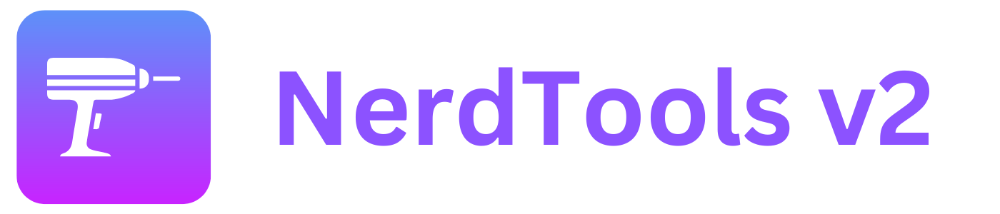
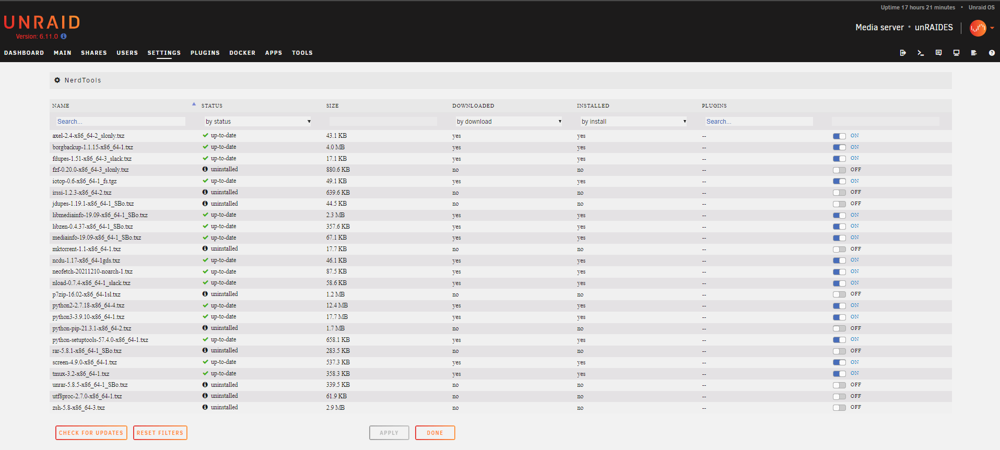

# Experimental

The previous iteration of this very useful Unraid plugin has been abandoned. I'm hoping to get it up and running again, but it's still a work in progress and not functional yet.

# Unraid-NerdTools_v2

**Install and Uninstall extra packages easily.**

##

NerdTools v2 is the most recent iteration of the popular Unraid plugin that allows you to easily install additional packages in Unraid. This project is based on the early NerdPack plugin, which was then renamed and maintained as NerdTools with many improvements. NerdTools has been abandoned, so NerdTools v2 is born with support for Unraid 7.x.
